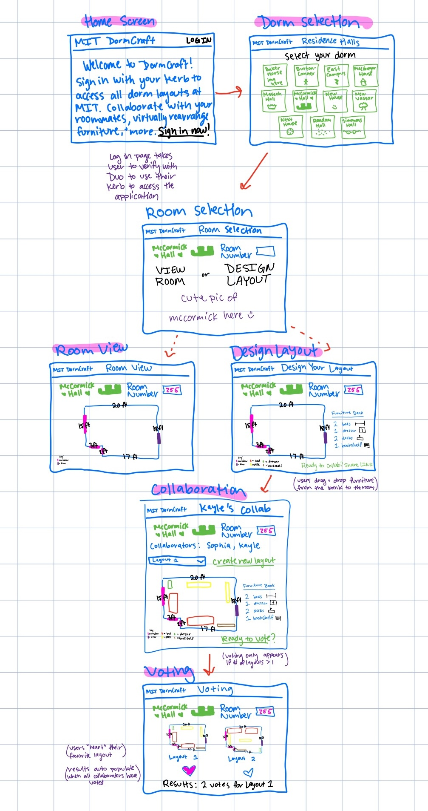

# 
MIT DormCraft: Problem Statement

**Problem Domain: MIT Dorm Room Layout**
 
Dorm living is a central part of the MIT student experience, yet planning how to use and personalize the limited and uniquely shaped space can be stressful. I care about this domain because I’ve personally faced challenges moving into dorms. Students have little to no idea what their room would look like until move-in, dealing with quirks like unexpected alcoves, all while students are trying to coordinate with roommates how to organize the furniture and space under time pressure.
 
 

**Problem: Roommate Collaboration on Layout**
 
One key problem faced by users within this domain is that when one roommate moves in earlier, they may claim the “best” side of the room and arrange furniture to their advantage, leaving the later roommate frustrated and disadvantaged. Without a way to preview the room and collaborate before move-in, students often experience unnecessary tension.
 
 

**Stakeholders:**
 
* Students: Primary users who need to visualize and agree on layouts before move-in.
* Roommates/Suitemates: Collaborators whose comfort depends on shared decision-making.
* REX Chairs: MIT student leaders who want students to feel positive about dorm life rather than stressed about space conflicts.
* MIT Housing Office: Administrators who benefit from reduced roommate conflicts and fewer requests for room changes.
 
 

**Evidence and Comparables:**
 
* [MIT Housing Dimensions](https://mitguidetoresidences.mit.edu/residences): MIT already publishes dorm layouts and floor plans, but they are not interactive, leaving gaps in usability.
* [IKEA Room Planner](https://www.ikea.com/us/en/home-design/room-builder/): A tool allowing customers to visualize furniture in custom spaces, showing the value of interactive layout planning.
* [Dorm Move In Reddit Threads](https://www.reddit.com/r/college/comments/6m5mfd/dorm_layout_thread/): Multiple posts by college students highlight stress from unknown layouts and roommate disagreements. These threads also show students are looking at the layouts of their rooms but there is a lack of interactive layout planning.
* [RoomSketcher](https://www.roomsketcher.com/): Commercial room planning software demonstrates feasibility of easy-to-use digital floor plans.
* MIT Move-In Conflicts (observed experience): Students frequently negotiate room sides during hectic move-in, sometimes resulting in tension or unfairness.
 
 
 

# 
MIT DormCraft: Application Pitch

**Name:**
 
DormCraft
 
 
**Motivation:**
 
Moving into MIT dorms is stressful, especially when roommates don’t know how the room looks or how to share space fairly. DormCraft solves this by giving students a collaborative, visual planning tool.
 
 
**Key Features:**
 
Visual Room Preview: 
 
DormCraft allows students to see their MIT dorm room in a fully digital format, capturing every detail, from alcoves and window placements to unique quirks like uneven corners or built-in shelving. By exploring the room virtually, students gain a realistic sense of the space and can start planning how they want to arrange their belongings. This early preview reduces the stress of uncertainty, giving students confidence and control over their new environment. It also benefits parents and the Housing Office, since students arrive prepared and fewer layout disputes arise.
 
 
Collaborative Layout Tool: 
 
Students can drag and drop furniture into their room’s digital model and invite roommates to view and edit the layout together. Changes update in real time, so both roommates can experiment with different arrangements, comment on ideas, and work toward a layout that works for both. This collaborative feature encourages communication and fairness, preventing one student from claiming the “best” side simply by moving in first. By facilitating shared planning, DormCraft helps roommates build a cooperative dynamic from the start, while student leaders and Housing staff see fewer conflicts during move-in.
 
 
Roommate Voting: 
 
When roommates disagree on a particular arrangement, DormCraft provides an in-app voting system that allows them to propose multiple layouts and select a winning option democratically. Each student’s vote is counted, and the agreed-upon layout is saved automatically for future reference. This feature ensures that decisions are fair, transparent, and collaborative, reducing tension and resentment. The process leaves students feeling empowered and respected, and Housing staff benefit from smoother move-ins with fewer disputes needing intervention.
 
 
 

# 
MIT DormCraft: Concept Design

**Concept 1: Room Model**

    concept: RoomModel

    purpose: Provide accurate digital representations of MIT dorm rooms, capturing the size, unique shapes, and quirks (such as alcoves, window placements, etc.). This is the foundation for all other features since layouts and collaboration rely on an accurate virtual room.

    principle: Every layout interaction requires knowing the exact space being worked with. The room model is static once defined but can be retrieved and referenced across sessions.

    state:
        - a set of Rooms with
            roomID              String
            dimensions          Float × Float
            features            List<{type: String, position: Coordinates}>
        
    actions:
    - getRoom(roomID: String): (room: Room)
        effects: returns the Room object for a given dorm room ID
        
    - viewRoomFeatures(roomID: String): (features: List)
        effects: returns special quirks/features associated with the room

**Concept 2: Furniture Library**

    concept: FurnitureLibrary

    purpose: Provide a set of standardized, movable digital furniture items that mirror MIT-provided furniture. These serve as building blocks that can be placed into any room layout.

    principle: Furniture items are reusable across different rooms and layouts. They do not assume room-specific information but must be placed within the spatial boundaries defined by a RoomModel.

    state:
        - a set of Furniture with
            furnitureID         String
            dimensions          Float × Float
            movable             Boolean
        
    actions:
    - getFurnitureList(): (furniture: List)
        effects: returns all available furniture pieces

    - placeFurniture(room: Room, furniture: Furniture, position: Coordinates)
        requires: furniture dimensions fit inside the room’s dimensions
        effects: updates the layout with the placed furniture item

**Concept 3: Collaboration Board**

    concept: CollaborationBoard

    purpose: Allow roommates to jointly propose, edit, and comment on room layouts in real time. Serves as the shared workspace where layouts are iterated on.

    principle: The board provides a generic space for collaborative editing. In DormCraft, it is specifically instantiated with room layouts generated using the RoomModel and FurnitureLibrary.

    state:
        - a set of Boards with
            boardID             String
            users               Set
            layouts             Set
            comments            List<{user: User, text: String, timestamp: Float}>
        
    actions:
    - addLayout(board: Board, layout: Layout)
        effects: stores a new proposed layout in the board

    - comment(board: Board, user: User, text: String)
        effects: attaches a comment to the board

    - shareLink(board: Board): (url: String)
        effects: generates a shareable link for collaborators

**Concept 4: Voting System**

    concept: VotingSystem

    purpose: Provide a fair mechanism for resolving layout disagreements by enabling polls on proposed layouts.

    principle: The system is generic and can apply to any kind of poll. In DormCraft, it is instantiated with layouts from the CollaborationBoard.
    
    state:
        - a set of Polls with
            pollID              String
            options             List
            votes               Map<User, Layout>
        
    actions:
    - createPoll(board: Board, options: List): (poll: Poll)
        requites: at least 2 layout options exist
        effects: creates a poll tied to the board’s layouts

    - castVote(poll: Poll, user: User, option: Layout)
        requires: user is a poll participant
        effects: records a vote for a layout option

    - tallyVotes(poll: Poll): (winner: Layout)
        effects: determines the winning layout
 
 

**Essential Synchronizations:**
* When a room model is loaded, it syncs with the furniture library to show compatible items.
* When a new layout is added to the collaboration board, it becomes a voting option in the voting system.
* Votes in the voting system sync back to mark a “winning” layout on the collaboration board.
 
 

**Notes:**
* The Room Model concept provides the foundation by encoding MIT’s unique dorm room shapes and quirks. It does not depend on other concepts but serves as the environment in which layouts occur.
* The Furniture Library introduces modular building blocks (beds, desks, dressers) that can be instantiated in any room; it is generic in that furniture items can be applied to any room model without assuming knowledge of that room’s structure.
* The Collaboration Board concept enables interaction between users—it does not assume what kinds of objects are being shared, but in DormCraft it will be instantiated with room layouts generated from the Room Model and Furniture Library.
* The Voting System provides a generic mechanism for resolving disagreements. It takes proposed layouts (produced via the Collaboration Board) as its target type, but it does not make assumptions about how those layouts are represented internally.
 
Together, these concepts support the app’s main features: the Room Model and Furniture Library supply the raw materials, the Collaboration Board provides the shared workspace, and the Voting System ensures fair decision-making. Their independence means that, for example, the Voting System could just as easily be used for polls unrelated to layouts, and the Furniture Library could in principle be reused for planning other campus spaces. The instantiations of generic parameters are straightforward: the “user” type in the Collaboration Board and Voting System is bound to MIT students (roommates), and the “target items” of the Voting System are layout options stored on the board. This modularity makes the design extensible while keeping each concept’s purpose clear.
 
 
 

# 
MIT DormCraft: UI Sketches

  

# 
MIT DormCraft: User Journey

**Step 1 – What Triggers a Need**
 
Selena, a first-year MIT student, receives her dorm assignment in the summer. She’s excited but immediately begins to worry about what the room will look like and whether she’ll be stuck with the “bad” side of the room. Her roommate Alex is moving in earlier, which raises her anxiety that she might take the window spot and arrange furniture in a way that leaves Selena cramped. This uncertainty makes her feel like she’s starting her college experience at a disadvantage.
 
 
**Step 2 – Virtually Explore Space**
 
Selena logs into DormCraft and selects her dorm building and room number. She sees a digital layout of her room that includes its actual measurements and quirks, such as a small alcove near the door. For the first time, she can picture the space before even stepping foot inside it. The accurate rendering gives her a sense of relief because she now knows what she’s working with.
 
 
**Step 3 – Roommate Collaboration**
 
Selena uses the collaboration feature to invite Alex to the shared layout board. They both begin dragging and dropping beds, desks, and dressers from the furniture library into the room, watching changes happen in real time. Sara notices that Alex prefers to place her bed under the alcove, while she wants her desk near the window for natural light. Instead of arguing, they can see both preferences visually, which makes the conversation feel more constructive.
 
 
**Step 4 – Resolve Conflict**
 
When they reach a disagreement about who gets the window space, Selena creates a layout that she thinks would be a compromise and Alex does the same. They both use DormCraft’s voting system to create a quick poll. This turns what could have been an uncomfortable argument into a fair process where both voices are heard. The poll ensures that whichever option they choose feels like a mutual decision rather than one person forcing their preference.
 
 
**Step 5 – Outcome**
 
Alex casts her vote, and they agree to stick with the winning arrangement. The final layout is saved automatically, so both roommates can return to it later if they want to make adjustments. On move-in day, Selena feels much more confident because she knows exactly where her furniture will go and doesn’t have to negotiate while surrounded by boxes. Instead of starting college with conflict, both Selena and Alex feel like they’re on the same team from the beginning.
